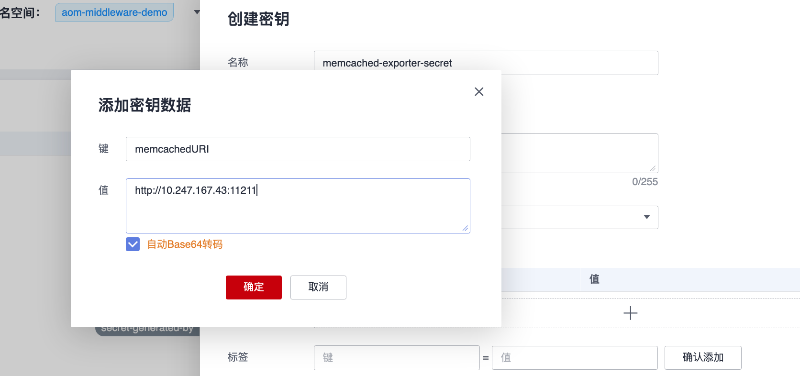
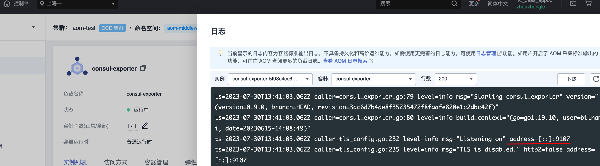
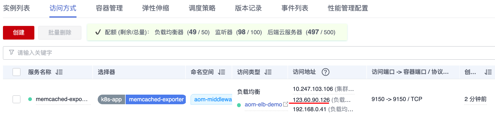
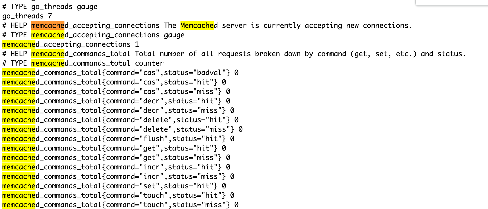
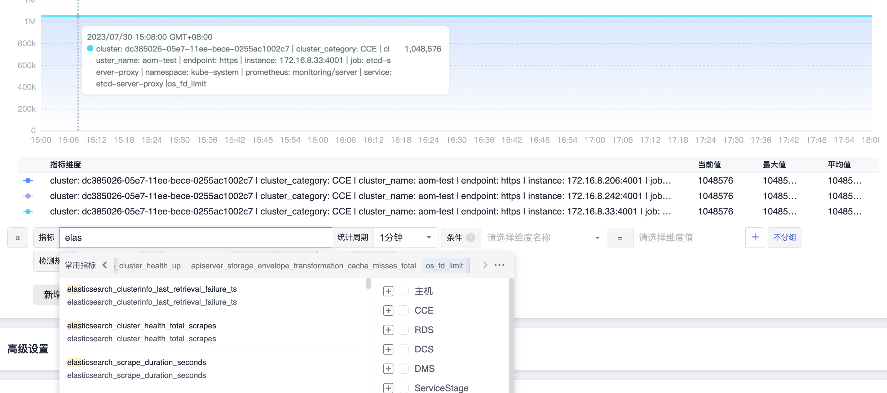
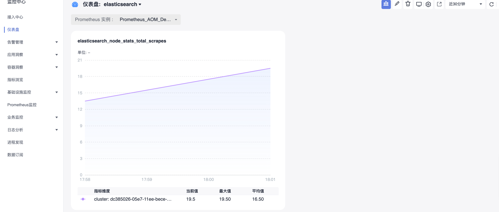

# Consul Exporter 接入

## 操作场景

在使用 Consul 过程中需要对 Consul 运行状态进行监控，以便了解 Consul 服务是否运行正常，排查 Consul 故障等。 Prometheus 监控服务提供基于 Exporter 的方式来监控 Consul 运行状态，并提供了开箱即用的 Grafana 监控大盘。本文为您介绍如何使用 Prometheus 监控服务 Consul。

> 为了方便安装管理 Exporter，推荐使用华为云 容器服务CCE 进行统一管理。

## 前提条件

- [CCE服务：已有CCE集群](https://console.huaweicloud.com/cce2.0)
- [华为云镜像服务SWR](https://console.huaweicloud.com/swr)
- [AOM服务：创建Prometheus For CCE实例，实例已关联集群](https://console.huaweicloud.com/aom2)
- 在集群中 安装exporter命名空间 和对应的 安装中间件命名空间 要相同

## 操作步骤

### 步骤1：Consul Exporter 部署

1. 登录 [容器服务](https://console.huaweicloud.com/cce2.0)。
2. 在左侧菜单栏中单击*集群*。
3. 选择某一个集群，进入该集群的管理页面。
4. 执行以下3个步骤完成 Exporter 部署。
   4.1 使用 Secret 管理 consul 连接串
   配置项与密钥 > YAML创建,输入以下yml文件，密码是按照Opaque加密过的。使用 Secret 管理 Consul 连接串，Consul链接串格式为10.247.3.138:8500。建议使用界面化操作（以memcached配置为例）如果使用yml创建，则需要密文。
   >  Consul 连接串的格式为 172.17.0.1:8500
    【建议】也可以使用界面化操作：
    
    ```yml
    apiVersion: v1
    kind: Secret
    metadata:
      name: consul-exporter-secret
      namespace: aom-middleware-demo
    type: Opaque
    data:
      consulURI: 10.247.3.138:8500  # 对应中间件监控地址,这里要转成密文才能通过yml文件创建
    ```
    4.2 部署 Consul Exporter
    在 Deployment 管理页面，单击新建，选择对应的命名空间来进行部署服务。可以通过控制台的方式创建，如下以 YAML 的方式部署 Exporter，YAML 配置示例如下：
    > 更多 Exporter 详细参数介绍请参见 [consul-exporter](https://github.com/prometheus/consul_exporter)。
    ```yaml
    apiVersion: apps/v1
    kind: Deployment
    metadata:
      labels:
        k8s-app: consul-exporter # 根据业务需要调整成对应的名称，建议加上 Redis 实例的信息
      name: consul-exporter # 根据业务需要调整成对应的名称，建议加上 Redis 实例的信息
      namespace: aom-middleware-demo
    spec:
      replicas: 1
      selector:
        matchLabels:
          k8s-app: consul-exporter # 根据业务需要调整成对应的名称，建议加上 Redis 实例的信息
      template:
        metadata:
          labels:
            k8s-app: consul-exporter # 根据业务需要调整成对应的名称，建议加上 Redis 实例的信息
        spec:
          containers:
            - name: consul-exporter
              env:
                - name: Consul_Url
                  valueFrom:
                    secretKeyRef:
                      name: consul-exporter-secret
                      key: consulURI
              command: ["consul_exporter", "--consul.server=$(Consul_Url)"]
              image: swr.cn-east-3.myhuaweicloud.com/aom-org/bitnami/consul-exporter:0.9.0
              imagePullPolicy: IfNotPresent
              ports:
                - containerPort: 9107
                  name: metric-port  # 这个名称在配置抓取任务的时候需要
              terminationMessagePath: /dev/termination-log
              terminationMessagePolicy: File
              securityContext:
                privileged: false
          dnsPolicy: ClusterFirst
          imagePullSecrets:
            - name: default-secret
          restartPolicy: Always
          schedulerName: default-scheduler
          securityContext: {}
          terminationGracePeriodSeconds: 30
    ```
    4.3 验证
    1. Deployment列表>Deployment详情>Pod实例>更多>日志，查看，可以查看到Exporter成功启动并暴露对应的访问地址，如下图所示：
    
    2. 单击 Pod 管理页签，进入 Pod 页面。
    3. 也可以通过创建一个外网的service，验证暴露的地址是否可以正常得到对应的指标,以memcached为例。
    
    4. 访问地址：http://123.60.5.226:9114/metrics,如发现未能得到对应的数据，验证完之后，可以把service删除，以memcached为例：
    

### 步骤2：添加采集任务

- 登录 [AOM](https://console.huaweicloud.com/aom2)
- 在左侧菜单栏中单击Prometheus监控，选择对应的Prometheus实例（For CCE实例类型）进入管理面。
- 点击服务发现
- 通过服务发现添加PodMonitor

```yml
apiVersion: monitoring.coreos.com/v1
kind: PodMonitor
metadata:
  name: memcached-exporter
  namespace: aom-middleware-demo
spec:
  namespaceSelector:
    matchNames:
      - aom-middleware-demo
  podMetricsEndpoints:
  - interval: 30s
    path: /metrics
    port: metric-port
  selector:
    matchLabels:
      k8s-app: memcached-exporter
```

## 在AOM上配置仪表盘和告警（以Memcached为例）


