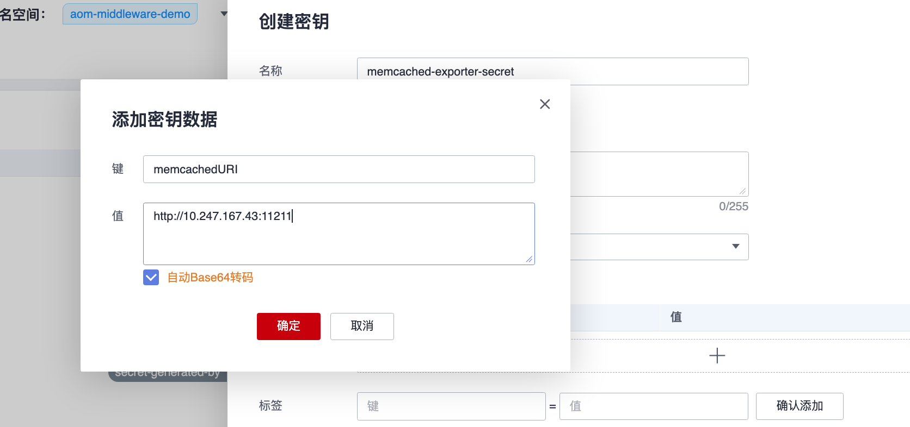
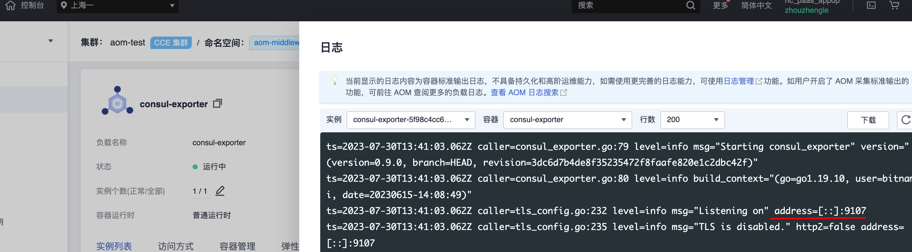
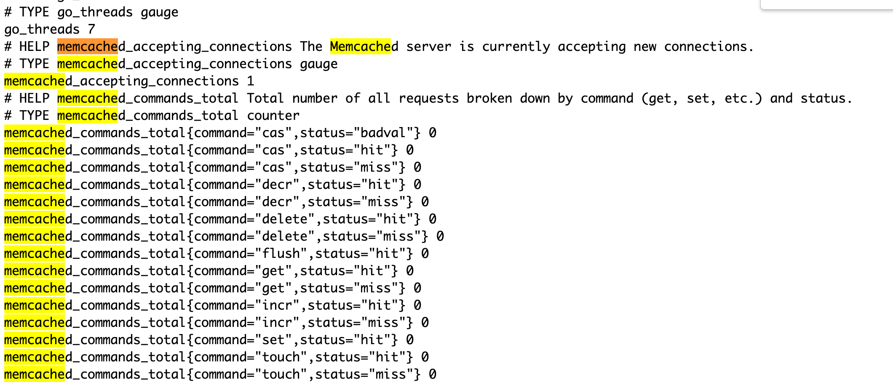
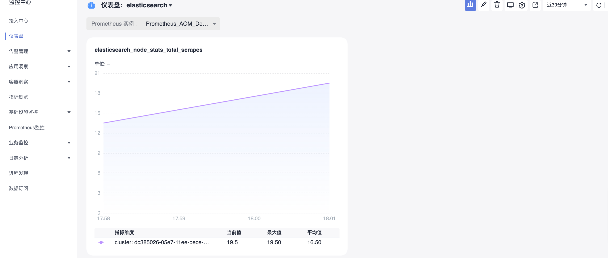

# Exporter 接入

## 操作场景

MySQL Exporter 是社区专门为采集 MySQL/MariaDB 数据库监控指标而设计开发，通过 Exporter 上报核心的数据库指标，用于异常报警和监控大盘展示，
目前，Exporter 支持高于5.6版本的 MySQL 和高于10.1版本的 MariaDB。在 MySQL/MariaDB 低于5.6版本时，部分监控指标可能无法被采集。

> 为了方便安装管理 Exporter，推荐使用华为云 容器服务CCE 进行统一管理。

## 前提条件

- [CCE服务：已有CCE集群](https://console.huaweicloud.com/cce2.0)
- [华为云镜像服务SWR](https://console.huaweicloud.com/swr)
- [AOM服务：创建Prometheus For CCE实例，实例已关联集群](https://console.huaweicloud.com/aom2)
- 在集群中 安装exporter命名空间 和对应的 安装中间件命名空间 要相同

## 操作步骤

### 步骤1：Exporter 部署

1. 登录 [容器服务](https://console.huaweicloud.com/cce2.0)。
2. 在左侧菜单栏中单击*集群*。
3. 选择某一个集群，进入该集群的管理页面。
4. 执行以下3个步骤完成 Exporter 部署。
   4.1 使用 Secret 管理 MySQL 连接串：配置项与密钥 > YAML创建,输入以下yml文件，密码是按照Opaque加密过的。使用 Secret 建议使用界面化操作（以memcached配置为例）如果使用yml创建，则需要密文。
    【建议】也可以使用界面化操作：
    
    ```yml
    apiVersion: v1
    kind: Secret
    metadata:
        name: mysql-secret
        namespace: aom-middleware-demo
    type: Opaque
    stringData:
        datasource: "user:password@tcp(ip:port)/"  #对应 MySQL 连接串信息，需要加密
    ```
    4.2 部署 Exporter
    在 Deployment 管理页面，单击新建，选择对应的命名空间来进行部署服务。可以通过控制台的方式创建，如下以 YAML 的方式部署 Exporter，YAML 配置示例如下：
    > 更多 Exporter 详细参数介绍请参见 [[mysql-exporter](https://github.com/prometheus/mysqld_exporter)
    ```yaml
    # exporter部署
    apiVersion: apps/v1
    kind: Deployment
    metadata:
    labels:
        k8s-app: mysql-exporter  # 根据业务需要调整成对应的名称，建议加上 MySQL 实例的信息
    name: mysql-exporter  # 根据业务需要调整成对应的名称，建议加上 MySQL 实例的信息
    namespace: aom-middleware-demo
    spec:
    replicas: 1
    selector:
        matchLabels:
        k8s-app: mysql-exporter  # 根据业务需要调整成对应的名称，建议加上 MySQL 实例的信息
    template:
        metadata:
        labels:
            k8s-app: mysql-exporter  # 根据业务需要调整成对应的名称，建议加上 MySQL 实例的信息
        spec:
        containers:
        - env:
            - name: DATA_SOURCE_NAME
            valueFrom:
                secretKeyRef:
                name: mysql-secret # 对应上一步中的 Secret 的名称
                key: datasource # 对应上一步中的 Secret Key
            image: swr.cn-east-3.myhuaweicloud.com/aom-org/mysqld-exporter:v0.12.1
            imagePullPolicy: IfNotPresent
            name: mysql-exporter
            ports:
            - containerPort: 9104
            name: metric-port 
            terminationMessagePath: /dev/termination-log
            terminationMessagePolicy: File
        dnsPolicy: ClusterFirst
        imagePullSecrets:
        - name: default-secret
        restartPolicy: Always
        schedulerName: default-scheduler
        securityContext: {}
        terminationGracePeriodSeconds: 30
    ```
    > Exporter 详细参数请参见 [mongodb_exporter](https://github.com/percona/mongodb_exporter)

    4.3 验证
    1. Deployment列表>Deployment详情>Pod实例>更多>日志，查看，可以查看到Exporter成功启动并暴露对应的访问地址，如下图所示：
    
    2. 单击 Pod 管理页签，进入 Pod 页面。
    3. 也可以通过创建一个外网的service，验证暴露的地址是否可以正常得到对应的指标,以memcached为例。
    
    4. 访问地址：http://123.60.5.226:9114/metrics,如发现未能得到对应的数据，验证完之后，可以把service删除，以memcached为例：
    

### 步骤2：添加采集任务

- 登录 [AOM](https://console.huaweicloud.com/aom2)
- 在左侧菜单栏中单击Prometheus监控，选择对应的Prometheus实例（For CCE实例类型）进入管理面。
- 点击服务发现
- 通过服务发现添加PodMonitor

```yml
# 通过PodMonitor采集数据到AOM
apiVersion: monitoring.coreos.com/v1
kind: PodMonitor
metadata:
  name: mysql-exporter  # 填写一个唯一名称
  namespace: aom-middleware-demo  # namespace固定，不要修改
spec:
  podMetricsEndpoints:
  - interval: 30s
    port: metric-port    # 填写pod yaml中Prometheus Exporter对应的Port的Name
    path: /metrics  # 填写Prometheus Exporter对应的Path的值，不填默认/metrics
    relabelings:
    - action: replace
      sourceLabels: 
      - instance
      regex: (.*)
      targetLabel: instance
      replacement: 'crs-xxxxxx' # 调整成对应的 MySQL 实例 ID
    - action: replace
      sourceLabels: 
      - instance
      regex: (.*)
      targetLabel: ip
      replacement: '1.x.x.x' # 调整成对应的 MySQL 实例 IP
  namespaceSelector:   # 选择要监控pod所在的namespace
    matchNames:
    - aom-middleware-demo
  selector:  # 填写要监控pod的Label值，以定位目标pod
    matchLabels:
      k8s-app: mysql-exporter
```

## 在AOM上配置仪表盘和告警（以Memcached为例）


