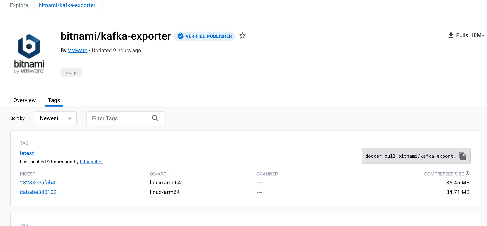
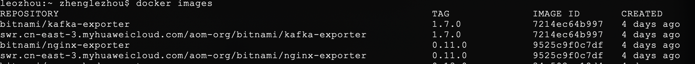
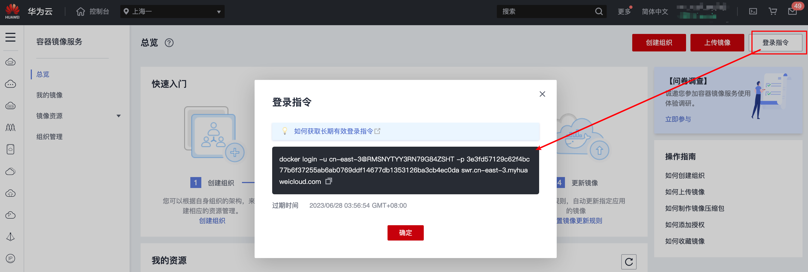
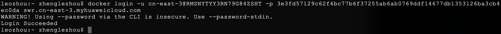
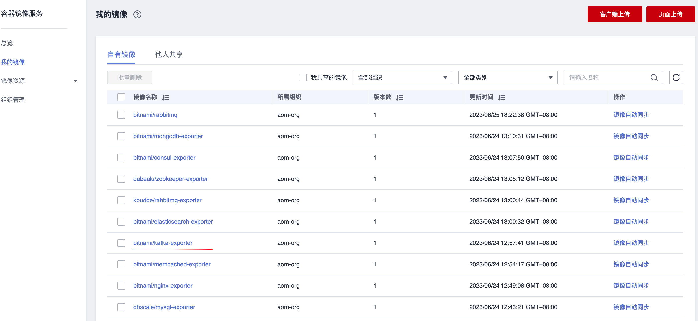

# CCE集群如何拉取prometheus-exporter

## 操作场景

在CCE集群中安装自定义中间件（例如kafka）并对*自定义中间件监控*，需要安装[Prometheus-exporter](https://prometheus.io/docs/instrumenting/exporters/)(kafka-exporter)。

> 为了方便安装管理 Exporter，推荐使用华为云 [容器镜像服务](https://console.huaweicloud.com/swr) 进行统一管理。

## 前提条件

- [华为云镜像服务SWR](https://console.huaweicloud.com/swr)
- 本地安装docker
- 可以访问hub.docker.com

## 操作步骤

### 步骤1：Exporter 下载

- 以Redis-exporter为例，首先进入[hub-docker镜像市场](https://hub.docker.com/)
- 搜索kafka-exporter,选择进入tag详情页


- 选择一个tag，点击复制
  ```bash
    docker pull bitnami/kafka-exporter:latest
  ```
- 下载完之后，查看镜像是否完成


### 步骤2：将镜像上传到华为云[镜像服务SWR](https://console.huaweicloud.com/swr)

- SWR镜像上传规则如下：swr.cn-east-3.myhuaweicloud.com/[*组织名*]/[*ImageName*]:[*镜像版本号*]。

- 将下载的kafka-exporter镜像打上tag，

  ```bash
    docker tag danielqsj/kafka-exporter:latest swr.cn-east-3.myhuaweicloud.com/aom-org/kafka-exporter:latest
  ```

- docker登录SWR镜像仓



- 上传镜像到镜像仓

  ``` bash
    docker push swr.cn-east-3.myhuaweicloud.com/aom-org/kafka-exporter:latest
  ```
  

- CCE容器里配置容器如下

  ```yaml
  spec:
    containers:
      ...
      image: swr.cn-east-3.myhuaweicloud.com/aom-org/kafka-exporter:latest
      imagePullPolicy: IfNotPresent
    ...
  ```
