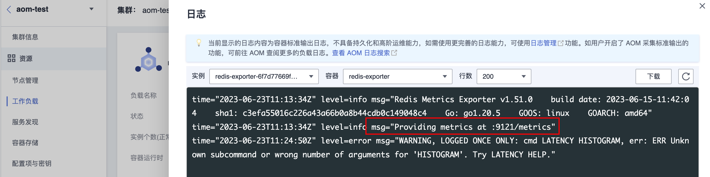
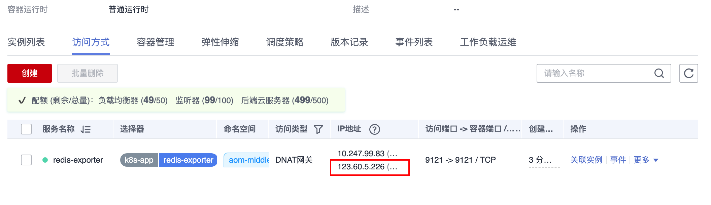
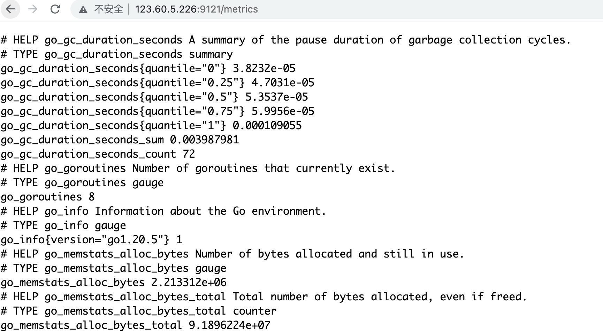
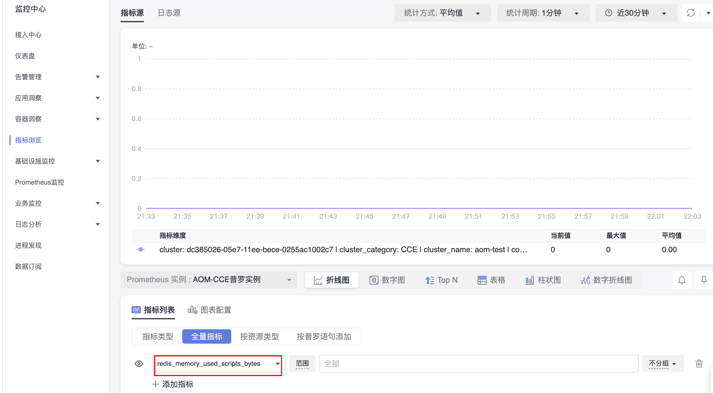
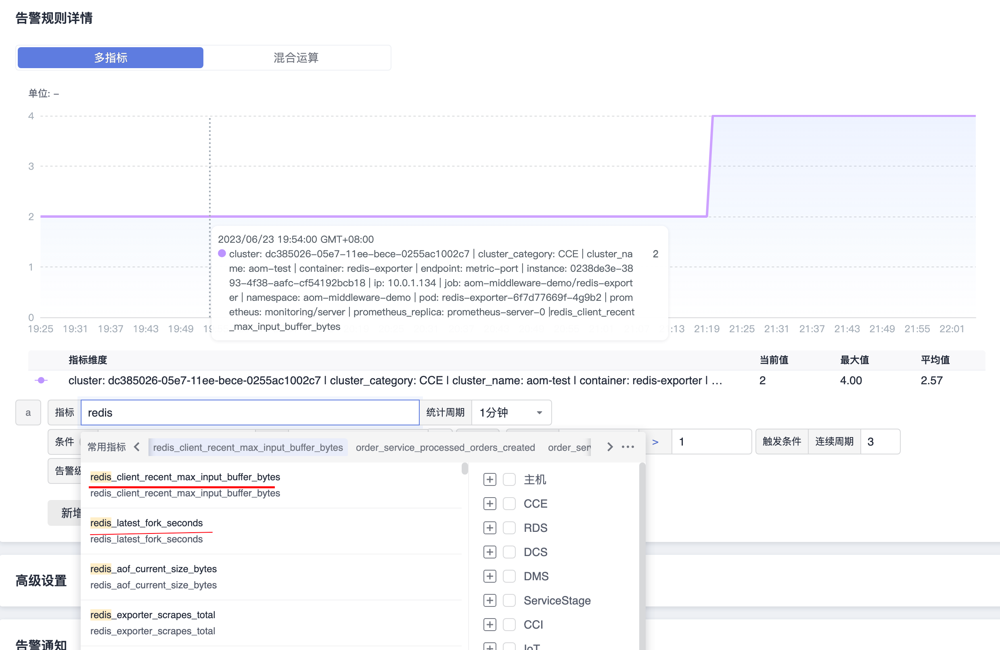

# Redis Exporter 接入

## 操作场景

在使用数据库 Redis 过程中需要对 Redis 运行状态进行监控，以便了解 Redis 服务是否运行正常，排查 Redis 故障等。Prometheus 监控服务提供基于 Exporter 的方式来监控 Redis 运行状态，并提供了开箱即用的 Grafana 监控大盘。本文为您介绍如何使用 Prometheus 监控 Redis。

> 为了方便安装管理 Exporter，推荐使用腾讯云 容器服务 进行统一管理。

## 前提条件

- [CCE服务：已有CCE集群](https://console.huaweicloud.com/cce2.0)
- [华为云镜像服务SWR](https://console.huaweicloud.com/swr)
- [AOM服务：创建Prometheus For CCE实例，实例已关联集群](https://console.huaweicloud.com/aom2)
- 在集群中exporter安装命名空间和对应的中间件命名空间要相同

## 操作步骤

### 步骤1：Exporter 部署

- 登录 [容器服务](https://console.huaweicloud.com/cce2.0)。
- 在左侧菜单栏中单击*集群*。
- 选择某一个集群，进入该集群的管理页面。
- 配置项与密钥 > YAML创建,输入以下yml文件，密码是按照Opaque加密过的。

  ```yml
  apiVersion: v1
  kind: Secret
  metadata:
    name: redis-secret
    namespace: aom-middleware-demo
  type: Opaque
  data:
    password: MTIzNDU2  #对应 Redis 密码
  ```

- 在CCE中配置拉取redis-exporter镜像，查看[CCE集群如何拉取prometheus-exporter](./CCE集群如何拉取prometheus-exporter.md)
- 创建redis-exporter的Deployment，YAML 配置示例如下：

  > 更多 Exporter 详细参数介绍请参见 [redis_exporter](https://github.com/oliver006/redis_exporter)。

  ```yaml
  apiVersion: v1
  kind: Secret
  metadata:
    name: redis-secret
    namespace: aom-middleware-demo
  type: Opaque
  data:
    password: MTIzNDU2  #对应 Redis 密码
  ---
  apiVersion: apps/v1
  kind: Deployment
  metadata:
    labels:
      k8s-app: redis-exporter # 根据业务需要调整成对应的名称，建议加上 Redis 实例的信息
    name: redis-exporter # 根据业务需要调整成对应的名称，建议加上 Redis 实例的信息
    namespace: aom-middleware-demo
  spec:
    replicas: 1
    selector:
      matchLabels:
        k8s-app: redis-exporter # 根据业务需要调整成对应的名称，建议加上 Redis 实例的信息
    template:
      metadata:
        labels:
          k8s-app: redis-exporter # 根据业务需要调整成对应的名称，建议加上 Redis 实例的信息
      spec:
        containers:
        - env:
          - name: REDIS_ADDR
            value: 10.247.176.30:6379 # 对应 Redis 的 ip:port
          - name: REDIS_PASSWORD
            valueFrom:
              secretKeyRef:
                name: redis-secret
                key: password
          image: swr.cn-east-3.myhuaweicloud.com/aom-org/bitnami/redis-exporter:latest
          imagePullPolicy: IfNotPresent
          name: redis-exporter
          ports:
          - containerPort: 9121
            name: metric-port  # 这个名称在配置抓取任务的时候需要
          securityContext:
            privileged: false
          terminationMessagePath: /dev/termination-log
          terminationMessagePolicy: File
        dnsPolicy: ClusterFirst
        imagePullSecrets:
        - name: default-secret
        restartPolicy: Always
        schedulerName: default-scheduler
        securityContext: {}
        terminationGracePeriodSeconds: 30
  ```

### 步骤3：验证

1. Deployment列表>Deployment详情>Pod实例>更多>日志，查看，可以查看到Exporter成功启动并暴露对应的访问地址，如下图所示：

2. 单击 Pod 管理页签，进入 Pod 页面。
3. 通过创建一个外网的service，验证暴露的地址是否可以正常得到对应的redis指标。

4. 访问地址：http://123.60.5.226:9121/metrics,如发现未能得到对应的数据，请检查一下 REDIS_ADDR 和 REDIS_PASSWORD 是否正确,验证完之后，可以把service删除，示例如下：


### 步骤4：添加采集任务

- 方法1【$\color{red} {推荐}$】：通过ServiceMonitor配置
  - 登录 [AOM](https://console.huaweicloud.com/aom2)
  - 在左侧菜单栏中单击Prometheus监控，选择对应的Prometheus实例（For CCE实例类型）进入管理面。
  - 点击服务发现
  - 通过服务发现添加PodMonitor

```yml
apiVersion: monitoring.coreos.com/v1
kind: PodMonitor
metadata:
  name: redis-exporter # 填写一个唯一名称
  namespace: aom-middleware-demo  # namespace固定，不要修改
spec:
  podMetricsEndpoints:
  - interval: 30s
    port: metric-port  # 填写pod yaml中Prometheus Exporter对应的Port的Name
    path: /metrics  # 填写Prometheus Exporter对应的Path的值，不填默认/metrics
    relabelings:
    - action: replace
      sourceLabels:
      - instance
      regex: (.*)
      targetLabel: instance
      replacement: '0238de3e-3893-4f38-aafc-cf54192bcb18' # 调整成对应的 Redis 实例 ID
    - action: replace
      sourceLabels:
      - instance
      regex: (.*)
      targetLabel: ip
      replacement: '10.0.1.134' # 调整成对应的 Redis 实例 IP
  namespaceSelector:   # 选择要监控pod所在的namespace
    matchNames:
    - aom-middleware-demo
  selector:    # 填写要监控pod的Label值，以定位目标pod
    matchLabels:
      k8s-app: redis-exporter
```

- 方法2：创建完之后，在工作负载prometheus-aom-huaweicloud-java-demo.yaml增加annotaion：

```yml
spec:
  replicas: 1
  selector:
    matchLabels:
      app: prometheus-aom-huaweicloud-java-demo
      version: v1
  template:
    metadata:
      creationTimestamp: null
      labels:
        app: prometheus-aom-huaweicloud-java-demo
        version: v1
      # 关键配置， CCE的kube-prometheus-stack插件将从暴露的自定义指标地址采集，并上报到AOM
      annotations:
        prometheus.io/scrape: "true"
        prometheus.io/port: "5002"
        prometheus.io/path: "/actuator/prometheus"
        prometheus.io/scheme: "http"
```


## 在AOM上配置仪表盘和告警



