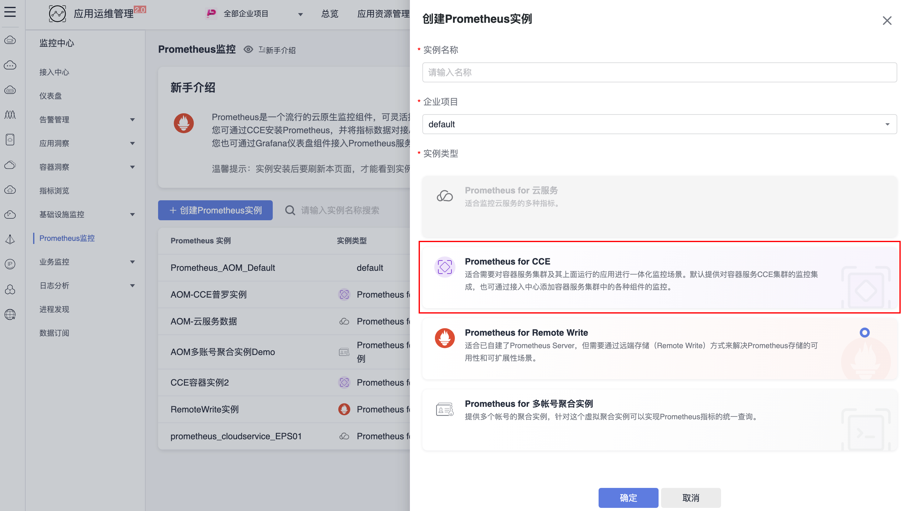
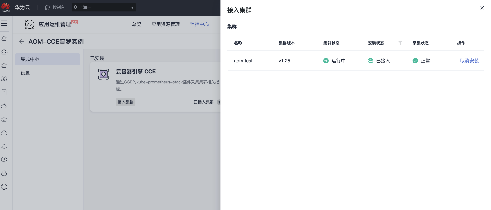
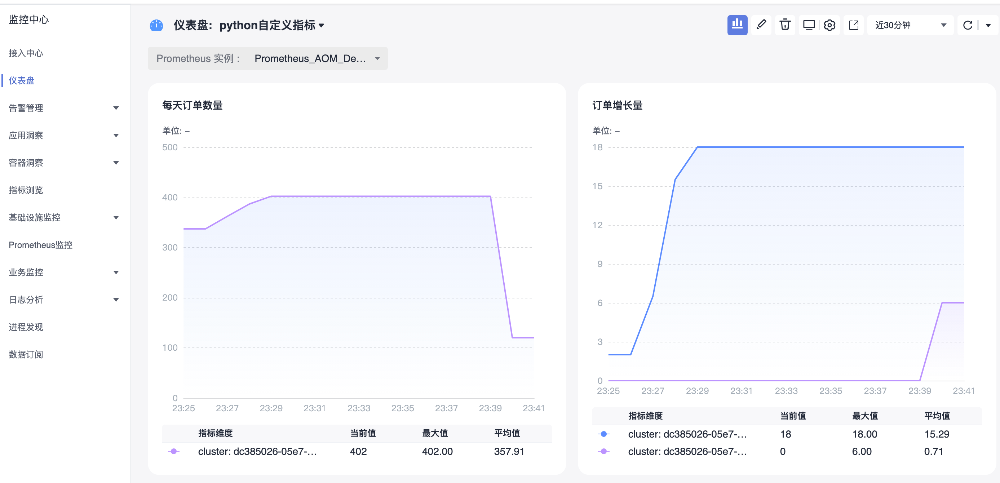
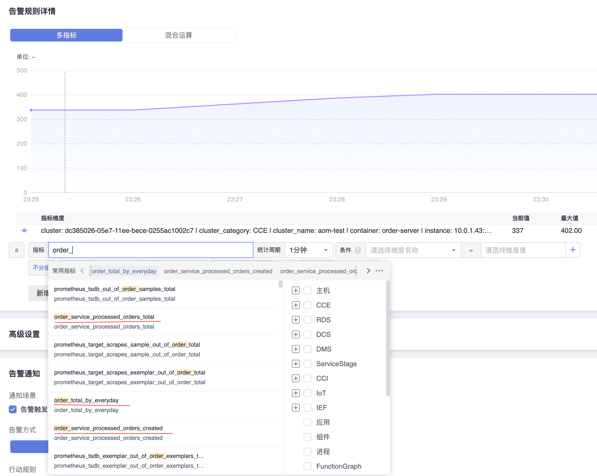

# Python自定义指标接入

## 操作场景

您可以通过 Prometheus 监控服务自定上报指标监控数据，对应用或者服务内部的一些状态进行监控，如请求处理数，下单数等，也可以对一些核心逻辑的处理耗时进行监控，如请求外部服务的耗时情况等。  
本文以 python 这个语言为例，介绍如何通过 Prometheus 监控服务进行业务自定义指标上报，可视化及告警。

## 数据模型

Prometheus 具有多维分析的能力，数据模型有如下几部分组成。
Metric Name(指标名称) + Labels(标签) + Timestamp(时间戳) + Value/Sample(监控值/样品)

- Metric Name(指标名称)：监控对象的含义（例如，http_request_total - 表示当前系统接收到的HTTP请求总量）。
- 标签(label)：表示当前样本的特征维度，是一个K/V结构，通过这些维度 Prometheus 可以对样-本数据进行过滤，聚合等。
- 时间戳(timestamp)：一个精确到毫秒的时间戳。
- 样本值(value)：一个float64的浮点型数据表示当前样本的值。
Metric Name(指标名称)/Labels(标签) 只能由ASCII字符、数字、下划线以及冒号组成，并必须符合正则表达[a-zA-Z_:][a-zA-Z0-9_:]*。

- [更多 Data Model 说明](https://prometheus.io/docs/concepts/data_model/)
- [Metric/Label 命名最佳实践](https://prometheus.io/docs/practices/naming/)

## 前提条件

- [CCE服务：已有CCE集群](https://console.huaweicloud.com/cce2.0)
- [华为云镜像服务SWR](https://console.huaweicloud.com/swr)
- [AOM服务：创建Prometheus For CCE实例，实例已关联集群](https://console.huaweicloud.com/aom2)

## Demo

[prometheus-aom-huaweicloud-python-demo](https://github.com/zhouzhengle/prometheus-aom-huaweicloud/tree/main/prometheus-aom-huaweicloud-python-demo)

## 如何监控埋点

Prometheus 根据监控的不同场景提供了 Counter/Gauge/Historgram/Summary 四种指标类型，每种指标类型说明可参见下文。更多说明请参见Prometheus官网 [METRIC TYPES](https://prometheus.io/docs/concepts/metric_types/)。
Prometheus 社区提供了多种开发语言的 SDK，每种语言的使用方法基本上类似，主要是开发语言语法上的区别，下面主要以 Go 作为例子如何上报自定义监控指标数据。

### Counter

计数类型，数据是单调递增的指标，服务重启之后会重置。可以用 Counter 来监控请求数/异常数/用户登录数/订单数等。
如何通过 Counter 来监控订单数：

```python
from random import randint
from flask import Flask, Response,jsonify
from prometheus_client import Counter, Gauge, Histogram, Summary, \
    generate_latest, CollectorRegistry
import random

app = Flask(__name__)

registry = CollectorRegistry()
counter = Counter('order_service_processed_orders_total', 'order total', ['order_type'], registry=registry)
gauge = Gauge('order_total_by_everyday', 'order number by everyday', ['order_type'], registry=registry)
# buckets = (100, 200, 300, 500, 1000, 3000, 10000, float('inf'))
# histogram = Histogram('api_calls_number', 'an example showed how to use histogram',
#                       ['order_type'], registry=registry, buckets=buckets)

@app.route('/makeFoodOrder')
def makeFoodOrder():
    # 业务代码
    counter.labels('food').inc(1)

    radom_number = random.randint(0,500)
    gauge.labels('food').set(radom_number)

    # 业务代码
    return jsonify({"success":True})

@app.route('/makeClothingOrder')
def makeClothingOrder():
    # 业务代码
    counter.labels('clothing').inc(1)

    radom_number = random.randint(0,500)
    gauge.labels('food').set(radom_number)
    # 业务代码
    return jsonify({"success":True})

# 把 Prometheus指标暴露在HTTP服务上
@app.route('/metrics')
def metrics():
    return Response(generate_latest(registry), mimetype='text/plain')

if __name__ == '__main__':
    app.run(host='0.0.0.0', port=5001)
```

## 使用 AOM托管Prometheus实例

上述我们提供了两个示例展示如何使用 Prometheus Python库来暴露应用的指标数据，但暴露的监控指标数据为文本类型，需要将指标对接到AOM的指标库中。

### 打包部署应用

01. python 应用一般使用如下打包（按需修改）

```Dockerfile
FROM python:3.9-alpine
WORKDIR /usr/local/order-server
COPY requirements.txt /usr/local/order-server
COPY order-server.py /usr/local/order-server
RUN /usr/local/bin/python -m pip install --upgrade pip
RUN pip install -r requirements.txt
EXPOSE 5001
CMD [ "python", "order-server.py"]
```

02. 将镜像推送到[华为云镜像服务](https://console.huaweicloud.com/swr/?region=cn-east-3#/swr/dashboard)

```bash
# 给镜像打上标签
docker tag order-server:2.0.3 swr.cn-east-3.myhuaweicloud.com/aom-org/order-server:2.0.3
```

```bash
# 推送到SWR
docker push swr.cn-east-3.myhuaweicloud.com/aom/leozhou/order-server:2.0.3
```

03. 需要根据应用类型定义一个 kubernets的工作负载资源

```yaml
kind: Deployment
apiVersion: apps/v1
metadata:
  name: order-server
  namespace: aom-custom-metrics-demo
spec:
  replicas: 1
  selector:
    matchLabels:
      app: order-server
      version: v1
  template:
    metadata:
      creationTimestamp: null
      labels:
        app: order-server
        version: v1
      annotations:
        # 关键配置， CCE的kube-prometheus-stack插件将从暴露的自定义指标地址采集，并上报到AOM
        prometheus.io/scrape: "true"
        prometheus.io/port: "5001"
        prometheus.io/path: "/metrics"
        prometheus.io/scheme: "http"
    spec:
      containers:
        - name: order-server
        # 自定义镜像，从SWR拉取
          image: swr.cn-east-3.myhuaweicloud.com/aom-org/order-server:2.0.3
          resources:
            limits:
              cpu: 250m
              memory: 512Mi
            requests:
              cpu: 250m
              memory: 512Mi
          imagePullPolicy: IfNotPresent
      restartPolicy: Always
      terminationGracePeriodSeconds: 30
      dnsPolicy: ClusterFirst
      securityContext: {}
      # 自定义镜像，需要配置secret
      imagePullSecrets:
        - name: default-secret
```

4. 创建Prometheus For CCE实例



5. 关联Prometheus实例与 CCE集群，集群里自定义指标即可以上报到该prometheus实例



### 在AOM上配置仪表盘和告警



