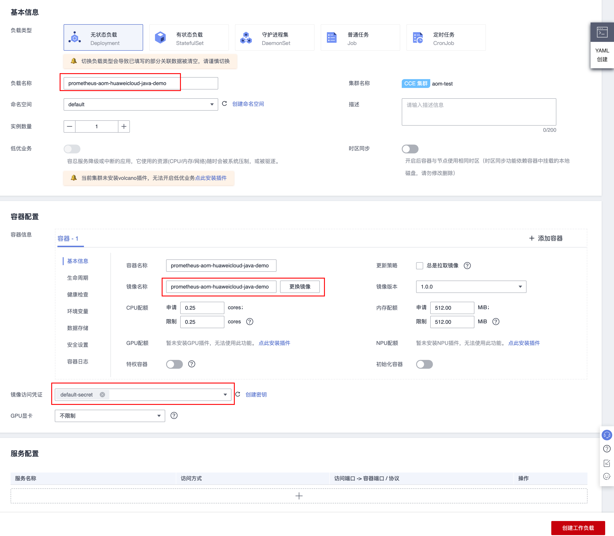
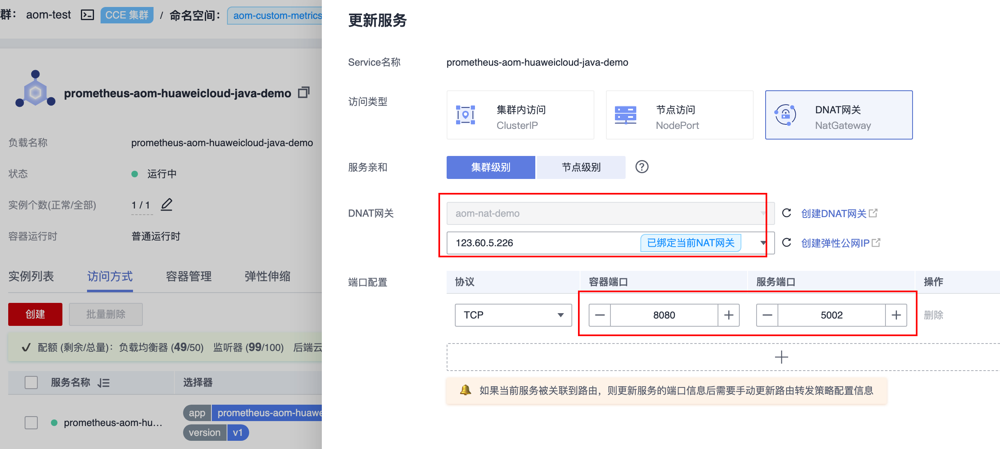
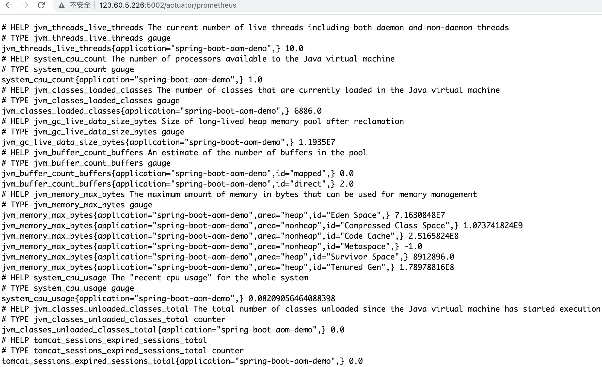
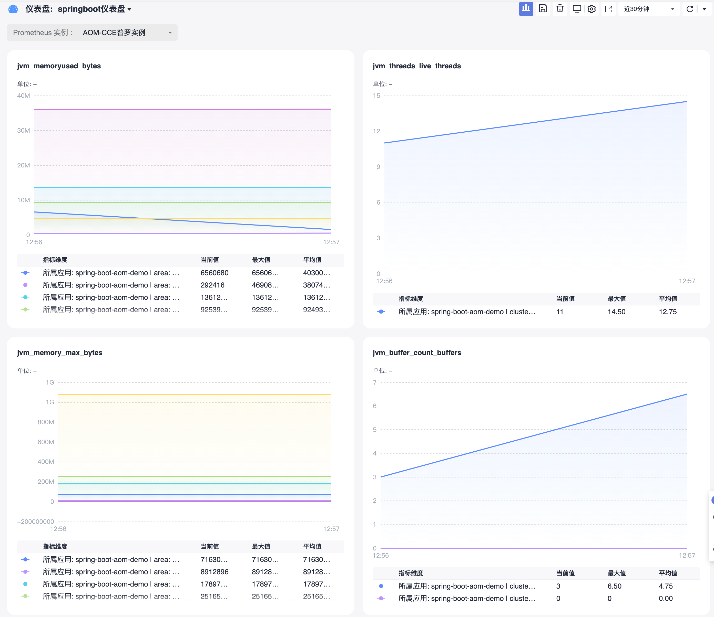
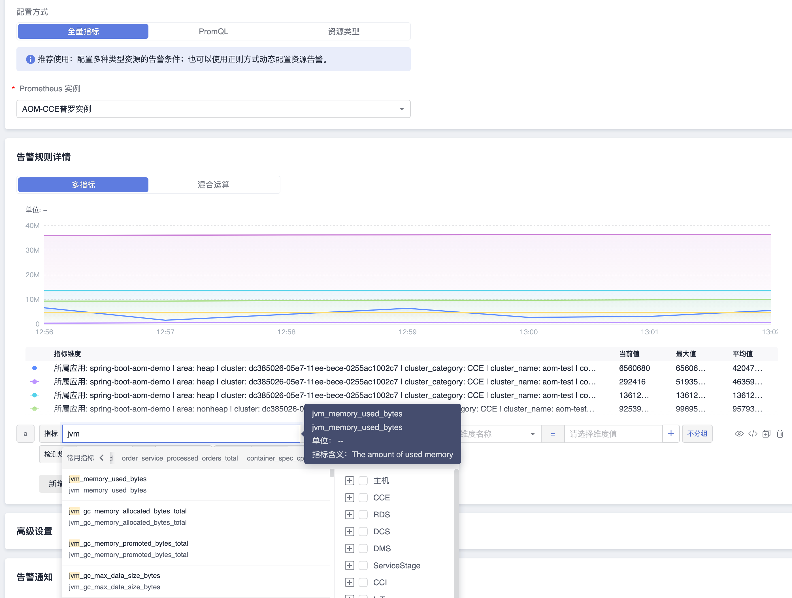

# Springboot自定义指标接入

## 操作场景

在使用 Spring Boot 作为开发框架时，需要监控应用的状态，例如 JVM/Spring MVC 等。 Prometheus 监控服务基于 Spring Actuator 机制采集 JVM 等数据，结合配套提供的 Grafana Dashboard 可以方便地监控 Spring Boot 应用的状态。
本文档以在容器服务上部署 Spring Boot 应用为例，介绍如何通过 Prometheus监控服务监控其状态。

## 前提条件

- [CCE服务：已有CCE集群](https://console.huaweicloud.com/cce2.0)
- [华为云镜像服务SWR](https://console.huaweicloud.com/swr)
- [AOM服务：创建Prometheus For CCE实例，实例已关联集群](https://console.huaweicloud.com/aom2)
- 应用基于 Spring Boot 框架进行开发。

## 操作步骤

>Spring Boot 已提供 actuator 组件来对应用进行监控，简化了开发的使用成本，所以这里直接使用 actuator 为 Spring Boot 应用进行监控埋点，基于 Spring Boot 2.0 及以上的版本，低版本会有配置上的差别需要注意。若您使用spring boot 1.5 接入，接入时和2.0会有一定区别，需要注意如下几点：
>1. 访问 prometheus metrics 的地址和2.0不一样，1.5默认的是/prometheus，即http://localhost:8080/prometheus。
>2. 若报401错误则表示没有权限(Whitelabel Error Page)，1.5默认对 management 接口加了安全控制，需要修改 management.security.enabled=false。
>3. 若项目中用 bootstrap.yml 来配置参数，在 bootstrap.yml 中修改 management 不起作用，需要在 application.yml 中修改，原因： spring boot 启动加载顺序有关。
>4. metric common tag 不能通过 yml 来添加，只有通过代码加一个 bean 的方式添加，详细信息可参见 spring boot 1.5 接入。


## Demo
[prometheus-aom-huaweicloud-python-demo](https://github.com/zhouzhengle/prometheus-aom-huaweicloud/tree/main/prometheus-aom-huaweicloud-python-demo)

## 修改应用的依赖及配置

### 步骤1：修改 pom 依赖

项目中已经引用 spring-boot-starter-web 的基础上，在 pom.xml 文件中添加 actuator/prometheus Maven 依赖项。

```xml
<dependency>
  <groupId>org.springframework.boot</groupId>
  <artifactId>spring-boot-starter-actuator</artifactId>
</dependency>
<dependency>
  <groupId>io.micrometer</groupId>
  <artifactId>micrometer-registry-prometheus</artifactId>
</dependency>
```
Prometheus 根据监控的不同场景提供了 Counter/Gauge/Historgram/Summary 四种指标类型，每种指标类型说明可参见下文。更多说明请参见Prometheus官网 [METRIC TYPES](https://prometheus.io/docs/concepts/metric_types/)。
Prometheus 社区提供了多种开发语言的 SDK，每种语言的使用方法基本上类似，主要是开发语言语法上的区别，下面主要以 Go 作为例子如何上报自定义监控指标数据。

### 修改配置

编辑 resources 目录下的 application.yml 文件，修改 actuator 相关的配置来暴露 Prometheus 协议的指标数据

```yaml
management:
  endpoints:
    web:
      exposure:
        include: prometheus  # 打开 Prometheus 的 Web 访问 Path
  metrics:
    # 下面选项建议打开，以监控 http 请求的 P99/P95 等，具体的时间分布可以根据实际情况设置
    distribution:
      sla:
        http:
          server:
            requests: 1ms,5ms,10ms,50ms,100ms,200ms,500ms,1s,5s
    # 在 Prometheus 中添加特别的 Labels
    tags:
      # 必须加上对应的应用名，因为需要以应用的维度来查看对应的监控
      application: spring-boot-aom-demo
```

### 步骤3：本地验证

在项目当前目录下，运行 mvn spring-boot:run 之后，可以通过 http://localhost:8080/actuator/prometheus 访问到 Prometheus 协议的指标数据，说明相关的依赖配置已经正确。

> 说明：
> 例子中配置默认配置，对应的端口和路径以实际项目为准。

## 将应用发布到华为云容器CCE服务上

上述我们提供了两个示例展示如何使用 Prometheus Python库来暴露应用的指标数据，但暴露的监控指标数据为文本类型，需要将指标对接到AOM的指标库中。

### 步骤1：本地配置 Docker 镜像环境

如果本地之前未配置过 Docker 镜像环境，可以参见 [镜像仓库基本教程](https://support.huaweicloud.com/qs-swr/index.html) 进行配置，如果已经配置可以直接执行下一步。

### 步骤2：打包及上传镜像

01. 在项目根目录下添加 Dockerfile ，您可以参考如下示例进行添加，在实际项目中需要修改 Dockerfile 。

```Dockerfile
FROM openjdk:8-jdk
WORKDIR /prometheus-aom-huaweicloud-java-demo
ADD target/prometheus-aom-huaweicloud-java-demo-*.jar /prometheus-aom-huaweicloud-java-demo/spring-boot-demo.jar
CMD ["java","-jar","prometheus-aom-huaweicloud-java-demo.jar"]
```

02. 将镜像推送到[华为云镜像服务](https://console.huaweicloud.com/swr/?region=cn-east-3#/swr/dashboard)

```bash
# 给镜像打上标签
docker tag prometheus-aom-huaweicloud-java-demo:1.0.0 swr.cn-east-3.myhuaweicloud.com/aom-org/prometheus-aom-huaweicloud-java-demo:1.0.0
```

客户端上传镜像可以查看[客户端上传](https://support.huaweicloud.com/usermanual-swr/swr_01_0011.html)

```bash
# 推送到SWR
docker push swr.cn-east-3.myhuaweicloud.com/aom-org/prometheus-aom-huaweicloud-java-demo:1.0.0
```

03. 部署到CCE集群里

- 创建工作负载



- 创建service,暴露指标数据



- 访问查看暴露的指标



04. 添加采集任务

- 方法1：创建完之后，在工作负载prometheus-aom-huaweicloud-java-demo.yaml增加annotaion：

```yml
spec:
  replicas: 1
  selector:
    matchLabels:
      app: prometheus-aom-huaweicloud-java-demo
      version: v1
  template:
    metadata:
      creationTimestamp: null
      labels:
        app: prometheus-aom-huaweicloud-java-demo
        version: v1
      # 关键配置， CCE的kube-prometheus-stack插件将从暴露的自定义指标地址采集，并上报到AOM
      annotations:
        prometheus.io/scrape: "true"
        prometheus.io/port: "5002"
        prometheus.io/path: "/actuator/prometheus"
        prometheus.io/scheme: "http"
```

- 方法2：通过ServiceMonitor配置
  - 登录 [AOM](https://console.huaweicloud.com/aom2)
  - 在左侧菜单栏中单击Prometheus监控，选择对应的Prometheus实例（For CCE实例类型）进入管理面。
  - 点击服务发现
  - 通过服务发现添加ServiceMonitor

```yml
apiVersion: monitoring.coreos.com/v1
kind: ServiceMonitor
metadata:
  name: service-monitor-prometheus-aom-huaweicloud-java-demo1 # 填写一个唯一名称
  namespace: aom-custom-metrics-demo # namespace固定，不要修改
spec:
  endpoints:
  - interval: 30s
    port: cce-service-0 # 填写service yaml中Prometheus Exporter对应的Port的Name
    path: /actuator/prometheus  # 填写Prometheus Exporter对应的Path的值，不填默认/metrics
  namespaceSelector:  # 选择要监控service所在的namespace
    matchNames:
    - aom-custom-metrics-demo 
  selector: # 填写要监控service的Label值，以定位目标service
    matchLabels:
      app: prometheus-aom-huaweicloud-java-demo 
```

4. 创建Prometheus For CCE实例


5. 关联Prometheus实例与 CCE集群，集群里自定义指标即可以上报到该prometheus实例



### 在AOM上配置仪表盘和告警

