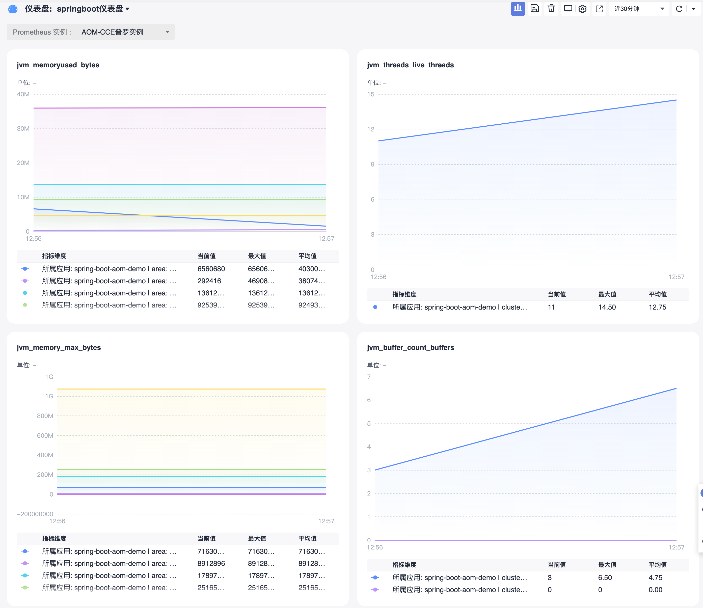

# JVM自定义指标接入

## 操作场景

在使用 Java 作为开发语言的时候，需要监控 JVM 的性能。 Prometheus 监控服务通过采集应用暴露出来的 JVM 监控数据，并提供了开箱即用的 Grafana 监控大盘。
本文以如何在容器服务上部署普通 Java 应用为例，介绍如何通过 Prometheus 监控服务监控其状态。

> 说明：若已使用 Spring Boot 作为开发框架，请参见 [Springboot自定义指标接入]()。

## 前提条件

- [CCE服务：已有CCE集群](https://console.huaweicloud.com/cce2.0)
- [华为云镜像服务SWR](https://console.huaweicloud.com/swr)
- [AOM服务：创建Prometheus For CCE实例，实例已关联集群](https://console.huaweicloud.com/aom2)

## 操作步骤

> 说明：Java 作为主流的开发语言其生态较为完善，其中 [micrometer](https://micrometer.io/) 作为指标打点 SDK 已经被广泛运行，本文以 micrometer 为例介绍如何监控 JVM。

## 修改应用的依赖及配置

### 步骤1：修改 pom 依赖

在 pom.xml 文件中添加相关的 Maven 依赖项，视情况调整相应的版本，示例如下：

```xml
<dependency>
    <groupId>io.prometheus</groupId>
    <artifactId>simpleclient</artifactId>
    <version>0.9.0</version>
</dependency>
<dependency>
    <groupId>io.micrometer</groupId>
    <artifactId>micrometer-registry-prometheus</artifactId>
    <version>1.1.7</version>
</dependency>
```

### 步骤2：修改代码

在项目启动时，添加相应的监控配置，同时 micrometer 也提供了部分常用的监控数据采集，具体在 io.micrometer.core.instrument.binder 包下，可以按实际情况添加。示例如下：

```java
public class Application {
    // 作为全局变量，可以在自定义监控中使用
    public static final PrometheusMeterRegistry registry = new PrometheusMeterRegistry(PrometheusConfig.DEFAULT);
    static {
        // 添加 Prometheus 全局 Label，建议加一下对应的应用名
        registry.config().commonTags("application", "java-demo");
    }


    public static void main(String[] args) throws Exception {
        // 添加 JVM 监控
        new ClassLoaderMetrics().bindTo(registry);
        new JvmMemoryMetrics().bindTo(registry);
        new JvmGcMetrics().bindTo(registry);
        new ProcessorMetrics().bindTo(registry);
        new JvmThreadMetrics().bindTo(registry);
        new UptimeMetrics().bindTo(registry);
        new FileDescriptorMetrics().bindTo(registry);
        System.gc(); // Test GC
        try {
            // 暴露 Prometheus HTTP 服务，如果已经有，可以使用已有的 HTTP Server
            HttpServer server = HttpServer.create(new InetSocketAddress(8080), 0);
            server.createContext("/metrics", httpExchange -> {
                String response = registry.scrape();
                httpExchange.sendResponseHeaders(200, response.getBytes().length);
                try (OutputStream os = httpExchange.getResponseBody()) {
                    os.write(response.getBytes());
                }
            });


            new Thread(server::start).start();
        } catch (IOException e) {
            throw new RuntimeException(e);
        }
    }
}
```
> 说明： 由于 JVM GC Pause 监控是通过 GarbageCollector Notification 机制实现，因此只有发生 GC 之后才有监控数据。上述示例为了测试更直观，主动调用了System.gc()。

### 步骤3：本地验证

本地启动之后，可以通过http://localhost:8080/metrics访问到 Prometheus 协议的指标数据。

> 说明：
> 例子中配置默认配置，对应的端口和路径以实际项目为准。

## 将应用发布到华为云容器CCE服务上

上述我们提供了两个示例展示如何使用 Prometheus Python库来暴露应用的指标数据，但暴露的监控指标数据为文本类型，需要将指标对接到AOM的指标库中。

### 步骤1：本地配置 Docker 镜像环境

如果本地之前未配置过 Docker 镜像环境，可以参见 [镜像仓库基本教程](https://support.huaweicloud.com/qs-swr/index.html) 进行配置，如果已经配置可以直接执行下一步。

### 步骤2：打包及上传镜像

01. 在项目根目录下添加 Dockerfile ，您可以参考如下示例进行添加，在实际项目中需要修改 Dockerfile 。

```Dockerfile
FROM openjdk:8-jdk
WORKDIR /java-demo
ADD target/java-demo-*.jar /java-demo/java-demo.jar
CMD ["java","-jar","java-demo.jar"]
```

02. 打包镜像,在项目根目录下运行如下命令

```bash
mvn clean package
docker build . -t swr.cn-east-3.myhuaweicloud.com/[组织名]/[ImageName]:[镜像版本号] .
docker push swr.cn-east-3.myhuaweicloud.com/组织名]/[ImageName]:[镜像版本号]
```

客户端上传镜像可以查看[客户端上传](https://support.huaweicloud.com/usermanual-swr/swr_01_0011.html)


03. 部署到CCE集群

当前采集任务与Deployment部署在一起配置

```yml
kind: Deployment
apiVersion: apps/v1
metadata:
  name: java-demo
  namespace: aom-custom-metrics-demo
spec:
  replicas: 1
  selector:
    matchLabels:
      app: java-demo
      version: v1
  template:
    metadata:
      creationTimestamp: null
      labels:
        app: java-demo
        version: v1
    spec:
      containers:
        - name: order-server
          image: swr.cn-east-3.myhuaweicloud.com/aom-org/java-demo:1.0.0
          resources:
            limits:
              cpu: 250m
              memory: 512Mi
            requests:
              cpu: 250m
              memory: 512Mi
          imagePullPolicy: IfNotPresent
      restartPolicy: Always
      terminationGracePeriodSeconds: 30
      dnsPolicy: ClusterFirst
      securityContext: {}
      imagePullSecrets:
        - name: default-secret
```
04. 添加采集任务


- 方法1：创建完之后，在工作负载prometheus-aom-huaweicloud-java-demo.yaml增加annotaion：

```yml
spec:
  replicas: 1
  selector:
    matchLabels:
      app: prometheus-aom-huaweicloud-java-demo
      version: v1
  template:
    metadata:
      creationTimestamp: null
      labels:
        app: prometheus-aom-huaweicloud-java-demo
        version: v1
      # 关键配置， CCE的kube-prometheus-stack插件将从暴露的自定义指标地址采集，并上报到AOM
      annotations:
        prometheus.io/scrape: "true"
        prometheus.io/port: "5002"
        prometheus.io/path: "/actuator/prometheus"
        prometheus.io/scheme: "http"
```

- 方法2：通过PodMonitor配置
  - 登录 [AOM](https://console.huaweicloud.com/aom2)
  - 在左侧菜单栏中单击Prometheus监控，选择对应的Prometheus实例（For CCE实例类型）进入管理面。
  - 单击集成容器服务，进入到容器服务集成管理页面。
  - 通过服务发现添加PodMonitor来定义 Prometheus 抓取任务，YAML 配置示例如下：

```yml
apiVersion: monitoring.coreos.com/v1
kind: PodMonitor
metadata:
  name: java-demo
  namespace: xxxxx
spec:
  namespaceSelector:
    matchNames:
    - java-demo
  podMetricsEndpoints:
  - interval: 30s
    path: /metrics
    port: metric-port
  selector:
    matchLabels:
      k8s-app: java-demo 
```

### 在AOM上查看监控

